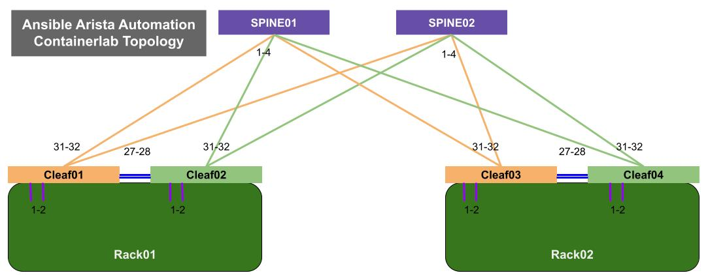

# Ansible Automation for Arista Network

 

## About

This repository is configured to run [`arista.eos`](https://github.com/aristanetworks/ansible-eos) & [`arista.avd`](https://github.com/aristanetworks/ansible-avd) Ansible collections against the ['containerlab'](https://containerlab.dev/) topology, an open famework network topology solution.

## Virtual Lab topology

The diagram below shows that the Containerlab topology has one leaf/spine cluster. To simplify the lab topology, only the cEOS based switch nodes are created without hosts. The virutal lab topolgy meta data is defined in [ceos.clab.yaml](./topology/ceos.clab.yaml).

<p align="center">
  
</p>

## Containerlab topology device list

| Device | IP Address |
| ------ | ------------ |
| spine01   |172.100.100.101 |
| spine02   |172.100.100.102 |
| s1-leaf1  |172.100.100.2 |
| s1-leaf2  |172.100.100.3 |
| s1-leaf3  |172.100.100.4 |
| s1-leaf4  |172.100.100.5 |
| s1-host1  |172.100.100.6 |
| s1-host2  |172.100.100.7 |

> Current repository is built with cEOS management interface (`Management0`). You can update `mgmt_interface` field to `Management1` in the [Lab yaml](./group_vars/lab.yaml) `group_vars`.

## Getting Started

### Spawn and inspect the containerlab

- Spawn the containerlab virtual topology

   ```shell
    # spawn containerlab
    containerlab deploy -t topology/ceos.clab.yaml --reconfigure
    ```

- Check the virtual topology state

   ```shell
    # inspect containerlab
    containerlab inspect -t topology/ceos.clab.yaml
    ```

### Connect to your Containerlab environment

- Connect to individual container from the local host

   ```shell
    # ssh the cleaf01, oob-ip is exposed in the inspect check output
    # credential as default (admin/admin).
    ssh admin@172.100.100.2
    ```

- Run ad hoc Ansible to check the topology

    - Execute the following command:

      ```shell
      # ad hoc, -m module, -a variable.
      ansible -m eos_command -a "commands='show version,show lldp neighbor'" lab -v
      ```

    - Check the end logs of the playbook running. There shall be no errors.

- Run the playbook to prepare deploy EVPN cluster

    - Execute the following command:

      ```shell
      # deploy the evpn cluster from scratch
      ansible-playbook lab_deploy.yaml
      ```

    - Check the end logs of the playbook running. There shall be no errors.

- Run the playbook to collect the logs

    - Execute the following command:

      ```shell
      # day2 operation with log collecting
      ansible-playbook lab_oper.yaml
      ```

- Run the playbook to generate the specific configuration

    - Execute the following command:

      ```shell
      # Config generation for the specific function
      ansible-playbook lab_cfggen.yaml -e "temp_file=bgp_fabric.yaml" -l cleaf01
      ```

- [Arista Ansible AVD Collection](https://github.com/aristanetworks/ansible-avd)
- [Arista CloudVision Collection](https://github.com/aristanetworks/ansible-cvp)
- [Arista AVD documentation](https://avd.arista.com)

## License

This Project is published under Apache License.
